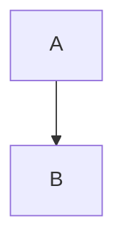

# Tetrate Platform NTT Demos

This repository contains demonstration scenarios for Tetrate Platform implementations, documented using MkDocs Material.

## 📋 Table of Contents

- [Repository Structure](#repository-structure)
- [Prerequisites](#prerequisites)
- [Getting Started](#getting-started)
- [Adding New Demos](#adding-new-demos)
- [Local Development](#local-development)
- [Deployment](#deployment)
- [Troubleshooting](#troubleshooting)

## 📁 Repository Structure

```
tetrate-platform-ntt/
├── demos/                          # Demo scenarios directory
│   ├── access-artifacts/
│   │   └── artifacts/
│   │       ├── Readme.md          # Demo documentation (REQUIRED)
│   │       ├── *.yaml             # Kubernetes manifests
│   │       ├── *.png              # Images/diagrams
│   │       └── Taskfile.yaml      # Task automation (optional)
│   ├── app-resilience/
│   │   ├── argocd/                # ArgoCD configurations (optional)
│   │   └── artifacts/
│   │       └── Readme.md          # Demo documentation (REQUIRED)
│   └── [demo-name]/               # Each demo follows this structure
│       └── artifacts/
│           └── Readme.md          # REQUIRED: Main documentation file
├── docs/                          # Generated MkDocs documentation (auto-generated)
│   ├── demos/                     # Symlinks to demo READMEs
│   ├── images/                    # Copied images from demos
│   ├── assets/                    # Logos and static assets
│   ├── stylesheets/
│   │   └── extra.css             # Custom CSS for cosmic theme
│   └── index.md                   # Home page (auto-generated)
├── mkdocs.yml                     # MkDocs configuration
├── netlify.toml                   # Netlify deployment config
├── requirements.txt               # Python dependencies
├── setup-mkdocs.sh               # Setup script (creates symlinks & copies images)
├── generate-index.sh             # Generates home page
└── README.md                      # This file
```

### Key Structure Rules

1. **Demo Location**: All demos must be under `demos/[demo-name]/`
2. **Required File**: Each demo MUST have `demos/[demo-name]/artifacts/Readme.md`
3. **Images**: Place images in the same `artifacts/` folder as `Readme.md`
4. **Naming**: Use lowercase with hyphens (e.g., `app-resilience`, `inter-cluster`)

## 🔧 Prerequisites

- Python 3.9+
- pip (Python package manager)
- Git

## 🚀 Getting Started

### 1. Clone the Repository

```bash
git clone https://github.com/tetratecx/tetrate-platform-ntt.git
cd tetrate-platform-ntt
```

### 2. Install Dependencies

```bash
pip install -r requirements.txt
```

### 3. Setup Documentation

```bash
chmod +x setup-mkdocs.sh generate-index.sh
./setup-mkdocs.sh
```

This script will:
- Create necessary directory structure
- Create symbolic links from `docs/demos/` to `demos/*/artifacts/Readme.md`
- Copy all images to `docs/images/`
- Auto-generate `docs/index.md`

### 4. Start Local Server - local testing before publishing

```bash
mkdocs serve
```

Visit `http://127.0.0.1:8000` to view the documentation.

## ➕ Adding New Demos

### Step 1: Create Demo Structure

```bash
# Create new demo directory
mkdir -p demos/my-new-demo/artifacts

# Create the documentation file
touch demos/my-new-demo/artifacts/Readme.md
```

### Step 2: Write Documentation

Edit `demos/my-new-demo/artifacts/Readme.md`:

```markdown
# My New Demo

Description of your demo...

## Architecture

<figure markdown>
  
  <figcaption>Architecture diagram description</figcaption>
</figure>

## Prerequisites

- Requirement 1
- Requirement 2

## Installation

Steps to install...
```

### Step 3: Add Images (Optional)

Place any images in the same directory:

```bash
cp my-diagram.png demos/my-new-demo/artifacts/
```

Reference images in your Readme.md using:

```markdown

```

### Step 4: Update Documentation

```bash
./setup-mkdocs.sh
```

This automatically:
- Creates symlink for the new demo
- Copies images to `docs/images/my-new-demo/`
- Regenerates `docs/index.md`

### Step 5: Update Navigation

Edit `mkdocs.yml` and add your demo to the `nav` section:

```yaml
nav:
  - Home: index.md
  - Demos:
    - Access Artifacts: demos/access-artifacts.md
    - App Resilience: demos/app-resilience.md
    # ... other demos ...
    - My New Demo: demos/my-new-demo.md  # Add this line
```

### Step 6: Verify Locally

```bash
mkdocs serve
```

Check your new demo appears in the left sidebar and displays correctly.

### Step 7: Commit and Push

```bash
git add demos/my-new-demo/
git add mkdocs.yml
git commit -m "Add my-new-demo documentation"
git push
```

## 💻 Local Development

### Running the Dev Server

```bash
mkdocs serve -a 127.0.0.1:8000
```

The server will auto-reload when you make changes to:
- Markdown files
- `mkdocs.yml`
- CSS files

### Rebuilding Documentation

After making changes to demo structure or adding images:

```bash
./setup-mkdocs.sh
```

### Building Static Site

To build the static site (outputs to `site/` directory):

```bash
mkdocs build
```

## 🌐 Deployment

### Netlify Deployment

The site is configured for automatic deployment to Netlify.

#### Continuous Deployment

Once pushed to main, Netlify automatically deploys on every push to the main branch.

### Configuration Files

- **netlify.toml**: Netlify build configuration
- **requirements.txt**: Python dependencies for build
- **mkdocs.yml**: MkDocs site configuration

## 🔍 Troubleshooting

### Images Not Showing

**Problem**: Images display in GitHub but not in MkDocs.

**Solution**: 
1. Ensure images are in `demos/[demo-name]/artifacts/`
2. Run `./setup-mkdocs.sh` to copy images
3. Use correct path in markdown: `../images/[demo-name]/image.png`

### Demo Not Appearing in Navigation

**Problem**: New demo created but not visible in sidebar.

**Solution**:
1. Verify `demos/[demo-name]/artifacts/Readme.md` exists
2. Run `./setup-mkdocs.sh`
3. Add entry to `nav` section in `mkdocs.yml`
4. Restart MkDocs server

### Mermaid Diagrams Not Rendering

**Problem**: Mermaid code shows as text instead of diagram.

**Solution**: Ensure mermaid code blocks use proper syntax:

````markdown

````

### Port Already in Use

**Problem**: `OSError: [Errno 48] Address already in use`

**Solution**:
```bash
# Kill existing process
lsof -ti:8000 | xargs kill -9

# Or use different port
mkdocs serve -a 127.0.0.1:8001
```

### Symlinks Broken

**Problem**: Documentation pages show 404 errors.

**Solution**:
```bash
# Remove and recreate symlinks
rm -f docs/demos/*.md
./setup-mkdocs.sh
```

## 🤝 Contributing

When contributing new demos:

1. Follow the established directory structure
2. Place all documentation in `artifacts/Readme.md`
3. Include architecture diagrams where applicable
4. Run `./setup-mkdocs.sh` after adding content
5. Update `mkdocs.yml` navigation
6. Test locally before pushing
7. Create clear, descriptive commit messages
