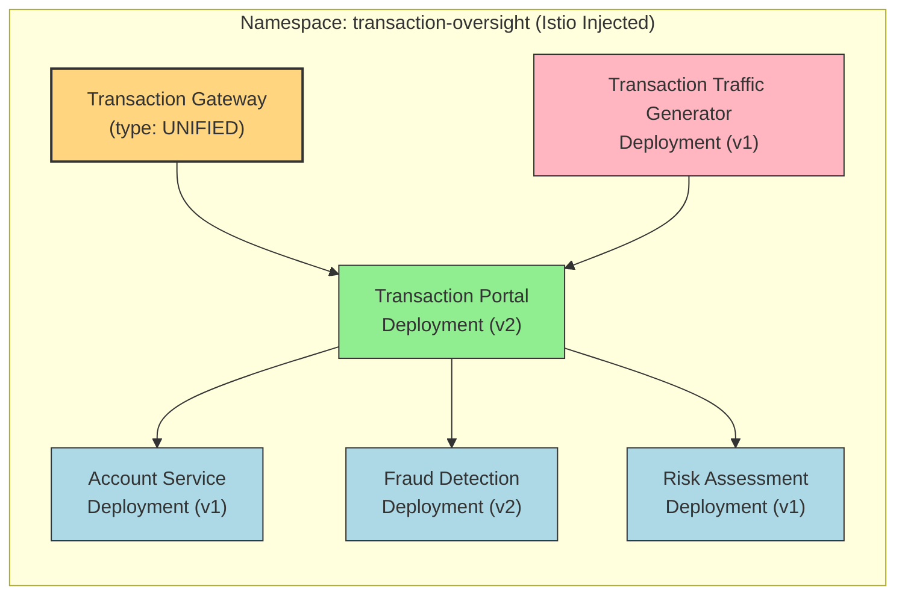

## Ussage - default installation

### What will be installed



1. Point your `kubectx` to the cluster where you;d like to install the app

```sh
kubectx <your cluster>
```

2. Run this command from `/tetrate-platform-ntt/demos/helm` directory:

```sh
kubectl create namespace transaction-oversight
kubectl label namespace transaction-oversight istio-injection=enabled

helm install transaction-portal ./app \
  --namespace transaction-oversight
```

You should see something like:

```sh
helm install transaction-portal ./app \
  --namespace transaction-oversight
NAME: transaction-portal
LAST DEPLOYED: Fri Sep 19 15:24:54 2025
NAMESPACE: transaction-oversight
STATUS: deployed
REVISION: 1
TEST SUITE: None
```

3. Validation:

```sh
kubectl get pods -n transaction-oversight
```

You should see something like:

```sh
kubectl get pods -n transaction-oversight
NAME                                            READY   STATUS    RESTARTS   AGE
account-service-v1-75df854b6d-mppkq             2/2     Running   0          20s
fraud-detection-v2-7d6c76d949-fxm85             2/2     Running   0          20s
risk-assessment-v1-6cb6c47b66-ngkx4             2/2     Running   0          20s
transaction-gw-7ff794d556-njqtq                 1/1     Running   0          19s
transaction-portal-v2-679fcc5d5b-rng9s          2/2     Running   0          20s
transaction-traffic-generator-56ddfb497-mj7dw   2/2     Running   0          20s
```


