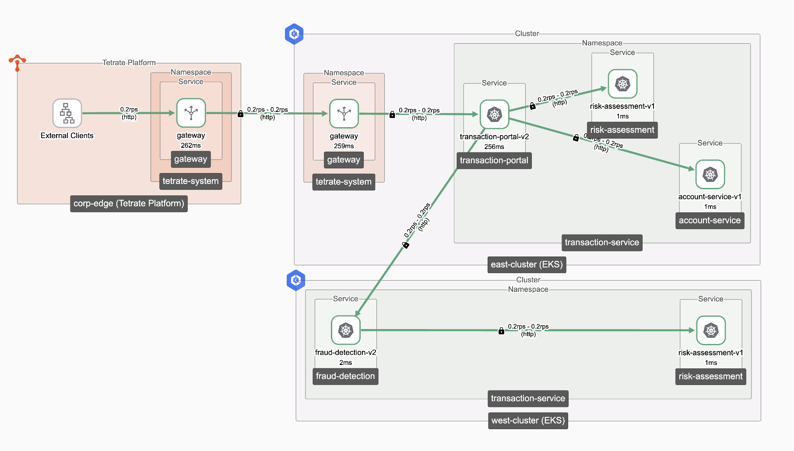

# Inter-cluster Communication Demo

Welcome to the **Inter-cluster Routing Demo**.  
Organizations running across multiple clusters, regions, or clouds often struggle with inefficient routing. Traffic usually takes the long way around — creating delays, security gaps, and complexity.



## Overview

### Why This Matters

Today, inter-cluster communication often relies on **hairpinning**:

- Traffic exits one cluster, re-enters another through an ingress gateway  
- Results in **unnecessary hops, latency, and overhead**

### With Tetrate Platform:

- Traffic flows **directly cluster-to-cluster** (shortest path)  
- **Latency drops by up to 50%**  
- **mTLS & identity policies** enforced consistently across regions  
- **No changes needed by app teams**

## Demo

## Prerequisites

Ensure you have the following installed and configured:

- Access to all required Kubernetes clusters
- `kubectl` and `kubectx`
- [`task`](https://taskfile.dev) (task runner)

## Setup Instructions

### 1. Deploy Application to East Cluster
```sh
kubectx east-cluster
kubectl apply -f east-app.yaml
```

### 2. Deploy Application to West Cluster
```sh
kubectx west-cluster
kubectl apply -f west-app.yaml
```

## Running the Demo

### Generate Traffic

Start continuous traffic generation to your application:
```sh
task generate-traffic
```

### Login to Tetrate Platform UI. What You’ll See

- **Real-time traffic visualization** in Tetrate Platform’s UI  
- **Shorter paths** and lower latency compared to traditional routing  
- **Federated trust & policy enforcement** across both clusters  

### The Value Proof

With Tetrate Platform, organizations gain:
- **Faster transactions & better customer experience**  
- **Stronger security across clusters and clouds**  
- **Unified visibility & policy control**  
- **Cleaner, more efficient architecture**  

## Technical Walkthrough

### Problem Statement

Traditional inter-cluster traffic relied on **hairpinning**:  
Traffic routed through centralized ingress gateways, back into another cluster.  
This leads to:  
- Increased latency from extra hops  
- Double encryption overhead  
- Complex DNS/IP routing  
- Inconsistent trust domains  

### How Tetrate Platform Solves It

With Tetrate Platform:
- Traffic routes **directly via east-west gateways**  
- **Global Service Registry** provides cross-cluster service discovery  
- **Federated trust domains** enforce mTLS & policies everywhere  
- **Affinity & locality-based routing** ensure the best path automatically
